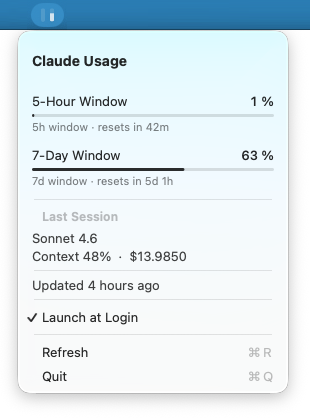

# UsageBar

A minimal macOS menu bar app that shows your Anthropic API rate limit usage as two small vertical bars.




## What it shows

Two slim vertical bars in your menu bar — one for the 5-hour window, one for the 7-day window. Each bar fills from the bottom as usage increases. Click the icon to see exact percentages, reset times, and last session details.

## Requirements

- macOS 12 or later
- Xcode Command Line Tools (`xcode-select --install`)
- [Claude Code](https://claude.ai/code)

## Install

```bash
git clone https://github.com/peerb/usage-bar
cd usage-bar
./install.sh
```

The script builds the binary, packages it as a `.app` bundle in `~/Applications/`, clears the Gatekeeper quarantine flag, and launches the app. On first start, the app registers itself to launch automatically at login.

Once installed you can open it anytime from Spotlight (`⌘ Space` → `UsageBar`) or Finder. It runs in the menu bar only — no Dock icon.

The menu bar updates within 30 seconds of each Claude Code API response.

## Troubleshooting

**The bar doesn't update**

Run Claude Code at least once — the app reads from `~/.claude/rate_limits_cache.json` which Claude Code writes automatically. Logs are written to `~/.claude/usagebar.log`.

## Forking

The bundle identifier `com.usagebar` appears in `Info.plist` and `Sources/UsageBar/main.swift`. If you fork this project, replace all occurrences with your own identifier to avoid LaunchAgent conflicts with the original.

## Uninstall

```bash
./uninstall.sh
```

## License

MIT — see [LICENSE](LICENSE).
